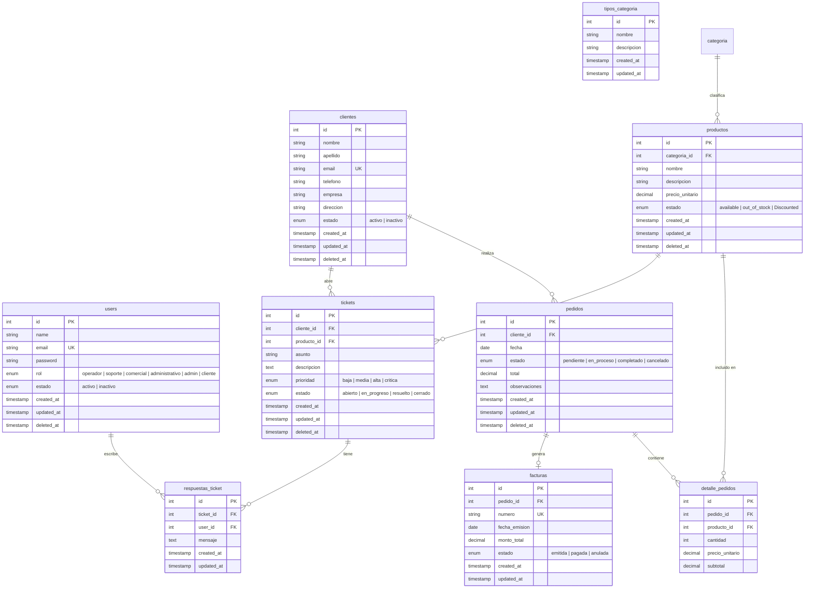

# Diagrama Entidad-Relación (DER) — CRM

## Diagrama

## Entidades y Atributos

### Users (Usuarios del sistema)

Usuarios internos que operan el CRM (operadores, soporte, admin, etc.).

| Atributo   | Tipo         | Restricciones             | Descripción                   |
| ---------- | ------------ | ------------------------- | ----------------------------- |
| id         | INTEGER      | PK, auto-increment        | Identificador único           |
| name       | VARCHAR(255) | NOT NULL                  | Nombre completo               |
| email      | VARCHAR(255) | NOT NULL, UNIQUE          | Email de acceso               |
| password   | VARCHAR(255) | NOT NULL                  | Contraseña hasheada           |
| role       | ENUM         | NOT NULL                  | Rol del usuario en el sistema |
| state      | ENUM         | NOT NULL, default: activo | Estado del usuario            |
| created_at | TIMESTAMP    |                           | Fecha de creación             |
| updated_at | TIMESTAMP    |                           | Fecha de última modificación  |
| deleted_at | TIMESTAMP    | nullable                  | Soft delete                   |

---

### Clients

Clientes de la empresa que adquieren productos y realizan pedidos.

| Atributo   | Tipo         | Restricciones             | Descripción                  |
| ---------- | ------------ | ------------------------- | ---------------------------- |
| id         | INTEGER      | PK, auto-increment        | Identificador único          |
| firstname  | VARCHAR(255) | NOT NULL                  | Nombre del cliente           |
| lastname   | VARCHAR(255) | NOT NULL                  | Apellido del cliente         |
| email      | VARCHAR(255) | NOT NULL, UNIQUE          | Email de contacto            |
| phone      | VARCHAR(50)  | nullable                  | Teléfono de contacto         |
| company    | VARCHAR(255) | nullable                  | Empresa a la que pertenece   |
| address    | TEXT         | nullable                  | Dirección física             |
| state      | ENUM         | NOT NULL, default: activo | activo / inactivo            |
| created_at | TIMESTAMP    |                           | Fecha de alta                |
| updated_at | TIMESTAMP    |                           | Fecha de última modificación |
| deleted_at | TIMESTAMP    | nullable                  | Soft delete                  |

---

### Products

Productos de software que comercializa la empresa.

| Atributo    | Tipo          | Restricciones               | Descripción                         |
| ----------- | ------------- | --------------------------- | ----------------------------------- |
| id          | INTEGER       | PK, auto-increment          | Identificador único                 |
| category_id | INTEGER       | FK → categoria.id, NOT NULL | Categoría del producto              |
| name        | VARCHAR(255)  | NOT NULL                    | Nombre del producto                 |
| description | TEXT          | nullable                    | Descripción del producto            |
| unit_price  | DECIMAL(10,2) | NOT NULL, default: 0.00     | Precio base por unidad del producto |
| state       | ENUM          | NOT NULL, default: activo   | activo / inactivo                   |
| created_at  | TIMESTAMP     |                             | Fecha de creación                   |
| updated_at  | TIMESTAMP     |                             | Fecha de última modificación        |
| deleted_at  | TIMESTAMP     | nullable                    | Soft delete                         |

---

### Category

Categorías de producto disponibles para clasificar el catálogo.

| Atributo    | Tipo         | Restricciones      | Descripción                  |
| ----------- | ------------ | ------------------ | ---------------------------- |
| id          | INTEGER      | PK, auto-increment | Identificador único          |
| name        | VARCHAR(255) | NOT NULL, UNIQUE   | Nombre de la categoría       |
| description | TEXT         | nullable           | Descripción de la categoría  |
| created_at  | TIMESTAMP    |                    | Fecha de creación            |
| updated_at  | TIMESTAMP    |                    | Fecha de última modificación |

---

### Orders

Pedidos realizados por los clientes.

| Atributo     | Tipo          | Restricciones                | Descripción                                                         |
| ------------ | ------------- | ---------------------------- | ------------------------------------------------------------------- |
| id           | INTEGER       | PK, auto-increment           | Identificador único                                                 |
| client_id    | INTEGER       | FK → clientes.id, NOT NULL   | Cliente que realizó el pedido                                       |
| date         | DATE          | NOT NULL                     | Fecha del pedido                                                    |
| state        | ENUM          | NOT NULL, default: pendiente | pendiente / en proceso / enviado / entregado / cancelado / devuelto |
| total        | DECIMAL(10,2) | NOT NULL, default: 0         | Monto total del pedido                                              |
| observations | TEXT          | nullable                     | Notas u observaciones                                               |
| created_at   | TIMESTAMP     |                              | Fecha de creación                                                   |
| updated_at   | TIMESTAMP     |                              | Fecha de última modificación                                        |
| deleted_at   | TIMESTAMP     | nullable                     | Soft delete                                                         |

---

### OrdersDetails

Líneas de detalle de cada pedido (productos solicitados).

| Atributo        | Tipo          | Restricciones               | Descripción                           |
| --------------- | ------------- | --------------------------- | ------------------------------------- |
| id              | INTEGER       | PK, auto-increment          | Identificador único                   |
| order_id        | INTEGER       | FK → pedidos.id, NOT NULL   | Pedido al que pertenece               |
| product_id      | INTEGER       | FK → productos.id, NOT NULL | Producto solicitado                   |
| count           | INTEGER       | NOT NULL, default: 1        | Cantidad solicitada                   |
| unit_price      | DECIMAL(10,2) | NOT NULL                    | Precio unitario al momento del pedido |
| subtotal        | DECIMAL(10,2) | NOT NULL                    | cantidad × precio_unitario            |

---

### facturas

Facturación asociada a los pedidos completados.

| Atributo      | Tipo          | Restricciones                     | Descripción                  |
| ------------- | ------------- | --------------------------------- | ---------------------------- |
| id            | INTEGER       | PK, auto-increment                | Identificador único          |
| pedido_id     | INTEGER       | FK → pedidos.id, NOT NULL, UNIQUE | Pedido facturado (1:1)       |
| numero        | VARCHAR(50)   | NOT NULL, UNIQUE                  | Número de factura            |
| fecha_emision | DATE          | NOT NULL                          | Fecha de emisión             |
| monto_total   | DECIMAL(10,2) | NOT NULL                          | Monto facturado              |
| estado        | ENUM          | NOT NULL, default: emitida        | emitida / pagada / anulada   |
| created_at    | TIMESTAMP     |                                   | Fecha de creación            |
| updated_at    | TIMESTAMP     |                                   | Fecha de última modificación |

---

### tickets

Tickets de soporte técnico abiertos por los clientes.

| Atributo    | Tipo         | Restricciones               | Descripción                                |
| ----------- | ------------ | --------------------------- | ------------------------------------------ |
| id          | INTEGER      | PK, auto-increment          | Identificador único                        |
| cliente_id  | INTEGER      | FK → clientes.id, NOT NULL  | Cliente que abre el ticket                 |
| producto_id | INTEGER      | FK → productos.id, nullable | Producto relacionado (opcional)            |
| asunto      | VARCHAR(255) | NOT NULL                    | Asunto del ticket                          |
| descripcion | TEXT         | NOT NULL                    | Descripción del problema                   |
| prioridad   | ENUM         | NOT NULL, default: media    | baja / media / alta / critica              |
| estado      | ENUM         | NOT NULL, default: abierto  | abierto / en_progreso / resuelto / cerrado |
| created_at  | TIMESTAMP    |                             | Fecha de apertura                          |
| updated_at  | TIMESTAMP    |                             | Fecha de última modificación               |
| deleted_at  | TIMESTAMP    | nullable                    | Soft delete                                |

---

### respuestas_ticket

Respuestas/mensajes dentro de un ticket de soporte.

| Atributo   | Tipo      | Restricciones             | Descripción                  |
| ---------- | --------- | ------------------------- | ---------------------------- |
| id         | INTEGER   | PK, auto-increment        | Identificador único          |
| ticket_id  | INTEGER   | FK → tickets.id, NOT NULL | Ticket al que pertenece      |
| user_id    | INTEGER   | FK → users.id, NOT NULL   | Usuario que responde         |
| mensaje    | TEXT      | NOT NULL                  | Contenido de la respuesta    |
| created_at | TIMESTAMP |                           | Fecha de creación            |
| updated_at | TIMESTAMP |                           | Fecha de última modificación |

---

## Relaciones

| Relación                    | Cardinalidad | Descripción                                             |
| --------------------------- | ------------ | ------------------------------------------------------- |
| clientes → pedidos          | 1:N          | Un cliente puede realizar muchos pedidos                |
| clientes → tickets          | 1:N          | Un cliente puede abrir muchos tickets                   |
| categoria → productos       | 1:N          | Una categoría puede clasificar muchos productos         |
| productos → detalle_pedidos | 1:N          | Un producto puede aparecer en muchos detalles de pedido |
| productos → tickets         | 1:N          | Un producto puede estar referenciado en muchos tickets  |
| pedidos → detalle_pedidos   | 1:N          | Un pedido contiene muchas líneas de detalle             |
| pedidos → facturas          | 1:1          | Un pedido genera una factura                            |
| tickets → respuestas_ticket | 1:N          | Un ticket tiene muchas respuestas                       |
| users → respuestas_ticket   | 1:N          | Un usuario puede escribir muchas respuestas             |
