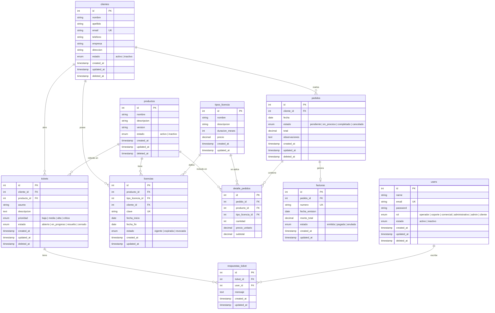

# Diagrama Entidad-Relación (DER) — CRM

## Diagrama

## Entidades y Atributos

### users (Usuarios del sistema)
Usuarios internos que operan el CRM (operadores, soporte, admin, etc.).

| Atributo | Tipo | Restricciones | Descripción |
|---|---|---|---|
| id | INTEGER | PK, auto-increment | Identificador único |
| name | VARCHAR(255) | NOT NULL | Nombre completo |
| email | VARCHAR(255) | NOT NULL, UNIQUE | Email de acceso |
| password | VARCHAR(255) | NOT NULL | Contraseña hasheada |
| rol | ENUM | NOT NULL | Rol del usuario en el sistema |
| estado | ENUM | NOT NULL, default: activo | Estado del usuario |
| created_at | TIMESTAMP | | Fecha de creación |
| updated_at | TIMESTAMP | | Fecha de última modificación |
| deleted_at | TIMESTAMP | nullable | Soft delete |

---

### clientes
Clientes de la empresa que adquieren productos/licencias.

| Atributo | Tipo | Restricciones | Descripción |
|---|---|---|---|
| id | INTEGER | PK, auto-increment | Identificador único |
| nombre | VARCHAR(255) | NOT NULL | Nombre del cliente |
| apellido | VARCHAR(255) | NOT NULL | Apellido del cliente |
| email | VARCHAR(255) | NOT NULL, UNIQUE | Email de contacto |
| telefono | VARCHAR(50) | nullable | Teléfono de contacto |
| empresa | VARCHAR(255) | nullable | Empresa a la que pertenece |
| direccion | TEXT | nullable | Dirección física |
| estado | ENUM | NOT NULL, default: activo | activo / inactivo |
| created_at | TIMESTAMP | | Fecha de alta |
| updated_at | TIMESTAMP | | Fecha de última modificación |
| deleted_at | TIMESTAMP | nullable | Soft delete |

---

### productos
Productos de software que comercializa la empresa.

| Atributo | Tipo | Restricciones | Descripción |
|---|---|---|---|
| id | INTEGER | PK, auto-increment | Identificador único |
| nombre | VARCHAR(255) | NOT NULL | Nombre del producto |
| descripcion | TEXT | nullable | Descripción del producto |
| version | VARCHAR(50) | nullable | Versión actual |
| estado | ENUM | NOT NULL, default: activo | activo / inactivo |
| created_at | TIMESTAMP | | Fecha de creación |
| updated_at | TIMESTAMP | | Fecha de última modificación |
| deleted_at | TIMESTAMP | nullable | Soft delete |

---

### tipos_licencia
Tipos de licencia disponibles para los productos (mensual, anual, perpetua, etc.).

| Atributo | Tipo | Restricciones | Descripción |
|---|---|---|---|
| id | INTEGER | PK, auto-increment | Identificador único |
| nombre | VARCHAR(255) | NOT NULL | Nombre del tipo (ej: "Anual", "Mensual") |
| descripcion | TEXT | nullable | Descripción del tipo de licencia |
| duracion_meses | INTEGER | NOT NULL | Duración en meses (0 = perpetua) |
| precio | DECIMAL(10,2) | NOT NULL | Precio base |
| created_at | TIMESTAMP | | Fecha de creación |
| updated_at | TIMESTAMP | | Fecha de última modificación |

---

### licencias
Licencias concretas asignadas a un cliente para un producto específico.

| Atributo | Tipo | Restricciones | Descripción |
|---|---|---|---|
| id | INTEGER | PK, auto-increment | Identificador único |
| producto_id | INTEGER | FK → productos.id | Producto asociado |
| tipo_licencia_id | INTEGER | FK → tipos_licencia.id | Tipo de licencia |
| cliente_id | INTEGER | FK → clientes.id | Cliente titular |
| clave | VARCHAR(255) | NOT NULL, UNIQUE | Clave/código de licencia |
| fecha_inicio | DATE | NOT NULL | Inicio de vigencia |
| fecha_fin | DATE | nullable | Fin de vigencia (null = perpetua) |
| estado | ENUM | NOT NULL | vigente / expirada / revocada |
| created_at | TIMESTAMP | | Fecha de creación |
| updated_at | TIMESTAMP | | Fecha de última modificación |

---

### pedidos
Pedidos realizados por los clientes.

| Atributo | Tipo | Restricciones | Descripción |
|---|---|---|---|
| id | INTEGER | PK, auto-increment | Identificador único |
| cliente_id | INTEGER | FK → clientes.id, NOT NULL | Cliente que realizó el pedido |
| fecha | DATE | NOT NULL | Fecha del pedido |
| estado | ENUM | NOT NULL, default: pendiente | pendiente / en_proceso / completado / cancelado |
| total | DECIMAL(10,2) | NOT NULL, default: 0 | Monto total del pedido |
| observaciones | TEXT | nullable | Notas u observaciones |
| created_at | TIMESTAMP | | Fecha de creación |
| updated_at | TIMESTAMP | | Fecha de última modificación |
| deleted_at | TIMESTAMP | nullable | Soft delete |

---

### detalle_pedidos
Líneas de detalle de cada pedido (productos y licencias solicitados).

| Atributo | Tipo | Restricciones | Descripción |
|---|---|---|---|
| id | INTEGER | PK, auto-increment | Identificador único |
| pedido_id | INTEGER | FK → pedidos.id, NOT NULL | Pedido al que pertenece |
| producto_id | INTEGER | FK → productos.id, NOT NULL | Producto solicitado |
| tipo_licencia_id | INTEGER | FK → tipos_licencia.id, NOT NULL | Tipo de licencia elegido |
| cantidad | INTEGER | NOT NULL, default: 1 | Cantidad solicitada |
| precio_unitario | DECIMAL(10,2) | NOT NULL | Precio unitario al momento del pedido |
| subtotal | DECIMAL(10,2) | NOT NULL | cantidad × precio_unitario |

---

### facturas
Facturación asociada a los pedidos completados.

| Atributo | Tipo | Restricciones | Descripción |
|---|---|---|---|
| id | INTEGER | PK, auto-increment | Identificador único |
| pedido_id | INTEGER | FK → pedidos.id, NOT NULL, UNIQUE | Pedido facturado (1:1) |
| numero | VARCHAR(50) | NOT NULL, UNIQUE | Número de factura |
| fecha_emision | DATE | NOT NULL | Fecha de emisión |
| monto_total | DECIMAL(10,2) | NOT NULL | Monto facturado |
| estado | ENUM | NOT NULL, default: emitida | emitida / pagada / anulada |
| created_at | TIMESTAMP | | Fecha de creación |
| updated_at | TIMESTAMP | | Fecha de última modificación |

---

### tickets
Tickets de soporte técnico abiertos por los clientes.

| Atributo | Tipo | Restricciones | Descripción |
|---|---|---|---|
| id | INTEGER | PK, auto-increment | Identificador único |
| cliente_id | INTEGER | FK → clientes.id, NOT NULL | Cliente que abre el ticket |
| producto_id | INTEGER | FK → productos.id, nullable | Producto relacionado (opcional) |
| asunto | VARCHAR(255) | NOT NULL | Asunto del ticket |
| descripcion | TEXT | NOT NULL | Descripción del problema |
| prioridad | ENUM | NOT NULL, default: media | baja / media / alta / critica |
| estado | ENUM | NOT NULL, default: abierto | abierto / en_progreso / resuelto / cerrado |
| created_at | TIMESTAMP | | Fecha de apertura |
| updated_at | TIMESTAMP | | Fecha de última modificación |
| deleted_at | TIMESTAMP | nullable | Soft delete |

---

### respuestas_ticket
Respuestas/mensajes dentro de un ticket de soporte.

| Atributo | Tipo | Restricciones | Descripción |
|---|---|---|---|
| id | INTEGER | PK, auto-increment | Identificador único |
| ticket_id | INTEGER | FK → tickets.id, NOT NULL | Ticket al que pertenece |
| user_id | INTEGER | FK → users.id, NOT NULL | Usuario que responde |
| mensaje | TEXT | NOT NULL | Contenido de la respuesta |
| created_at | TIMESTAMP | | Fecha de creación |
| updated_at | TIMESTAMP | | Fecha de última modificación |

---

## Relaciones

| Relación | Cardinalidad | Descripción |
|---|---|---|
| clientes → pedidos | 1:N | Un cliente puede realizar muchos pedidos |
| clientes → tickets | 1:N | Un cliente puede abrir muchos tickets |
| clientes → licencias | 1:N | Un cliente puede tener muchas licencias |
| productos → licencias | 1:N | Un producto puede tener muchas licencias emitidas |
| productos → detalle_pedidos | 1:N | Un producto puede aparecer en muchos detalles de pedido |
| productos → tickets | 1:N | Un producto puede estar referenciado en muchos tickets |
| tipos_licencia → licencias | 1:N | Un tipo de licencia se aplica a muchas licencias |
| tipos_licencia → detalle_pedidos | 1:N | Un tipo de licencia puede estar en muchos detalles de pedido |
| pedidos → detalle_pedidos | 1:N | Un pedido contiene muchas líneas de detalle |
| pedidos → facturas | 1:1 | Un pedido genera una factura |
| tickets → respuestas_ticket | 1:N | Un ticket tiene muchas respuestas |
| users → respuestas_ticket | 1:N | Un usuario puede escribir muchas respuestas |
