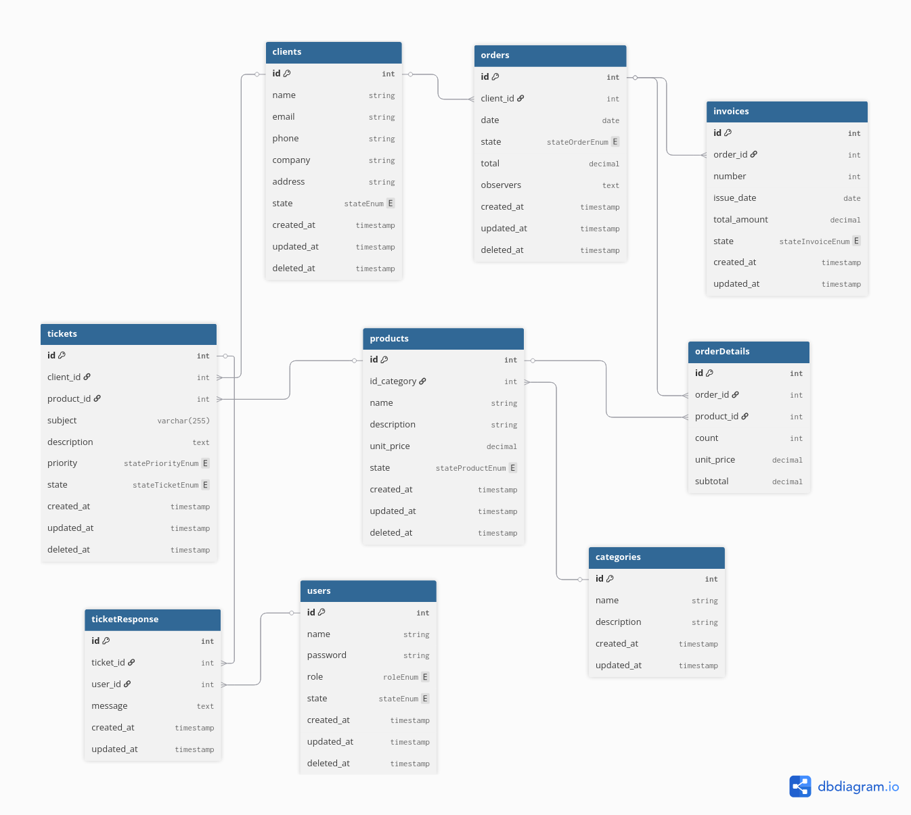

# Customer Relationship Management Pro (CRM Pro)
**Última actualización:** 13/04/2026

## Índice

1. [Objetivo](#objetivo)
2. [Alcance](#alcance)
3. [Arquitectura](#arquitectura)
4. [Stack Tecnológico](#stack-tecnológico)
5. [Módulos Funcionales (Resumen)](#módulos-funcionales-resumen)
6. [Roles y Usuario Objetivo](#roles-y-usuario-objetivo)
7. [Usabilidad y Calidad](#usabilidad-y-calidad)
8. [Requisitos Funcionales y No Funcionales](#requisitos-funcionales-y-no-funcionales)
9. [Plan de Sprints y Tiempo Estimado](#plan-de-sprints-y-tiempo-estimado)
10. [Modelo de Datos (DER)](#modelo-de-datos-der)

---

## Objetivo

Una aplicación web que centralice la operación comercial y de soporte de una empresa, estableciendo lineamientos funcionales, técnicos y de calidad para su construcción por etapas.

---

## Alcance

El proyecto abarcará un sistema único para centralizar la operación comercial y de soporte de una empresa.

Incluye:
- Gestión de clientes.
- Gestión de productos y categorías.
- Gestión de pedidos y facturación.
- Gestión de tickets de soporte.
- Administración de usuarios internos y permisos por rol.

---

## Arquitectura

Se adoptará una arquitectura monolítica basada en Laravel (MVC). La interfaz se renderizará del lado del servidor con Blade y la interactividad se resolverá con Livewire, sin una API REST separada en esta fase.

```
                    ┌───────────┐
                    │  Browser  │
                    └───────────┘
                          |
                          ▼
┌──────────────────────────────────────────────────────────────┐
│                         Laravel 13                           │
|──────────────────────────────────────────────────────────────|
│ Blade + Livewire │ Controllers │ Models │ Migrations/Rules   │
└──────────────────────────────────────────────────────────────┘
                          |
                          ▼
                     ┌───────────┐
                     │  SQLite   │
                     └───────────┘
```

---

## Stack Tecnológico

El stack previsto para la implementación inicial es el siguiente:

| Capa          | Tecnología                    | Notas                                          |
| ------------- | ----------------------------- | ---------------------------------------------- |
| Frontend      | Blade + Livewire 4 + Tailwind | Render server-side con interactividad reactiva |
| Backend       | Laravel 13 (PHP 8.3)          | Monolito con rutas web y componentes Livewire  |
| Base de Datos | SQLite                        | Archivo local, sin servidor separado           |
| Testing       | PHPUnit + Laravel Dusk        | Cobertura unitaria, feature/livewire y E2E     |

---

## Módulos Funcionales (Resumen)

Se contemplan los siguientes módulos funcionales para la primera versión del sistema:

### Gestión de Clientes
- Listado paginado con búsqueda y filtros.
- Alta y edición con validaciones.
- Baja lógica con confirmación y visibilidad por estado.

### Gestión de Productos y Categorías
- ABM de productos y categorías.
- Filtros por nombre, categoría y estado.
- Reglas de negocio para activación/desactivación y consistencia de catálogo.

### Gestión de Pedidos
- Alta de pedidos con múltiples líneas de detalle.
- Cálculo automático de subtotales y total.
- Listado, filtros y vista de detalle.
- Gestión de estados operativos del pedido.

### Gestión de Facturación
- Emisión de factura desde pedidos entregados.
- Listado/filtrado por número, cliente, estado y fecha.
- Detalle de factura y acciones de pago/anulación con validaciones.

### Gestión de Soporte (Tickets)
- Registro de tickets con prioridad y estado.
- Listado con filtros combinables.
- Vista de detalle con historial de respuestas.
- Reglas de transición de estado y reapertura.

### Administración de Usuarios
- Dashboard para rol administrador.
- Gestión de usuarios con filtros por rol/estado.
- Cambio de rol y estado con reglas de seguridad (ejemplo: proteger último admin activo).

### Calidad y pruebas automatizadas
- Suite de pruebas unitarias para reglas de negocio clave.
- Pruebas feature/livewire para flujos principales de cada módulo.
- Pruebas E2E con Dusk para escenarios críticos.

---

## Roles

### Definición

| Rol                      | Descripción                                          |
| ------------------------ | ---------------------------------------------------- |
| Operador                 | Gestiona clientes y realiza seguimiento de pedidos.  |
| Soporte                  | Atiende y resuelve tickets de soporte.               |
| Comercial                | Gestiona productos y pedidos.                        |
| Administrativo           | Gestiona facturación y control administrativo.       |
| Administrador de Sistema | Configura permisos y administración general del CRM. |
| Cliente                  | Consulta estado de pedidos y genera tickets.         |

### Autenticación

| Modulo          | Administrador | Soporte | Operador | Comercial | Administrativo | Cliente |
| --------------- | ------------- | ------- | -------- | --------- | -------------- | ------- |
| Clientes        |       X       |    X    |    X     |     X     |       X        |         |
| Productos       |       X       |    X    |          |     X     |                |         |
| Categorias      |       X       |         |          |     X     |                |         |
| Pedidos         |       X       |    X    |    X     |     X     |       X        |    X    |
| Facturas        |       X       |         |          |           |       X        |    X    |
| Tickets         |       X       |    X    |          |           |                |    X    |
| Usuarios        |       X       |         |          |           |                |         |

### Autorización

| Acción                         | Administrador | Soporte | Operador | Comercial | Administrativo | Cliente |
| ------------------------------ | ------------- | ------- | -------- | --------- | -------------- | ------- |
| Cliente.Listar                 |       X       |    X    |    X     |     X     |       X        |         |
| Cliente.Activar                |       X       |         |    X     |           |                |         |
| Cliente.Desactivar             |       X       |         |    X     |           |                |         |
| Cliente.Insertar               |       X       |         |    X     |           |                |         |
| Cliente.Actualizar             |       X       |         |    X     |           |                |         |
| Producto.Listar                |       X       |    X    |          |     X     |                |         |
| Producto.Activar               |       X       |         |          |     X     |                |         |
| Producto.Desactivar            |       X       |         |          |     X     |                |         |
| Producto.Insertar              |       X       |         |          |     X     |                |         |
| Producto.Actualizar            |       X       |         |          |     X     |                |         |
| Categoria.Listar               |       X       |         |          |     X     |                |         |
| Categoria.Desactivar           |       X       |         |          |     X     |                |         |
| Categoria.Insertar             |       X       |         |          |     X     |                |         |
| Categoria.Actualizar           |       X       |         |          |     X     |                |         |
| Pedido.Listar                  |       X       |    X    |    X     |     X     |       X        |    X    |
| Pedido.Insertar                |       X       |         |          |     X     |                |         |
| Pedido.InsertarDetalle         |       X       |         |          |     X     |                |         |
| Pedido.RecalcularTotal         |       X       |         |          |     X     |                |         |
| Pedido.CambiarEstado           |       X       |         |    X     |     X     |                |         |
| Pedido.Cancelar                |       X       |         |          |     X     |                |         |
| Factura.Listar                 |       X       |         |          |           |       X        |    X    |
| Factura.Generar                |       X       |         |          |           |       X        |         |
| Factura.MarcarComoPagada       |       X       |         |          |           |       X        |         |
| Factura.MarcarComoAnulada      |       X       |         |          |           |       X        |         |
| Ticket.Listar                  |       X       |    X    |          |           |                |    X    |
| Ticket.Crear                   |       X       |    X    |          |           |                |    X    |
| Ticket.CambiarPrioridad        |       X       |    X    |          |           |                |         |
| Ticket.CambiarEstado           |       X       |    X    |          |           |                |         |
| Ticket.AgregarRespuesta        |       X       |    X    |          |           |                |    X    |
| Usuario.Listar                 |       X       |         |          |           |                |         |
| Usuario.CambiarRol             |       X       |         |          |           |                |         |
| Cliente.CambiarEstado          |       X       |         |    X     |           |                |         |

## Usuario objetivo principal: Operador (Laura Pérez)

**Características:**
- 35 años.
- Licenciada en Administración de Empresas.
- Alta frecuencia de uso del sistema durante la jornada laboral.
- Necesidad de acceso rápido a clientes, pedidos y estados.

**Tareas principales:**
- Agendar nuevos clientes.
- Actualizar información de clientes existentes.
- Consultar y filtrar pedidos por estado.
- Realizar seguimiento del ciclo de vida de pedidos.

---

## Usabilidad y Calidad

### Facilidad de aprendizaje

La interfaz deberá orientarse a tareas operativas diarias con formularios guiados, filtros simples y acciones claras por módulo.

### Eficiencia

Las operaciones frecuentes (listar, filtrar, crear, editar, cambiar estado) deberán resolverse en pocos pasos.

### Tasa de errores

Se aplicarán validaciones en formularios y reglas de dominio para reducir errores operativos y mantener consistencia de datos.

### Criterio de calidad esperado

El sistema deberá contar con cobertura automatizada en módulos críticos (clientes, productos, pedidos, facturas, tickets y administración), incluyendo pruebas E2E para flujos principales.

---

## Requisitos Funcionales y No Funcionales

### Funcionales priorizados
- ABM completo de clientes.
- ABM completo de productos y categorías.
- Gestión de pedidos con seguimiento de estados.
- Facturación vinculada a pedidos.
- Gestión de tickets de soporte con respuestas y trazabilidad.
- Consultas y filtros sobre entidades principales.
- Administración de usuarios internos por rol y estado.
- Responsive UI

### No funcionales
| Requisito                             | Meta de diseño                                 |
| ------------------------------------- | ---------------------------------------------- |
| Interfaz intuitiva                    | Flujo claro en tareas principales              |
| Interfaz responsiva integral          | Adaptación completa en viewports definidos     |
| Validaciones en tiempo real           | Validación inmediata en formularios críticos   |
| Guardado automático de datos en curso | Evaluar implementación en flujos prioritarios  |
| Respuesta menor a 2 segundos          | Medir y optimizar rendimiento en producción    |

---

## Plan de Sprints y Tiempo Estimado

| Sprint   | Enfoque                               | Estado previsto | Tiempo estimado |
| -------- | ------------------------------------- | --------------- | --------------- |
| Sprint 1 | Setup del proyecto y autenticación    | Planificado     | 2 semanas       |
| Sprint 2 | Gestión de clientes                   | Planificado     | 2 semanas       |
| Sprint 3 | Gestión de productos y categorías     | Planificado     | 2 semanas       |
| Sprint 4 | Gestión de pedidos                    | Planificado     | 2 semanas       |
| Sprint 5 | Gestión de facturación                | Planificado     | 2 semanas       |
| Sprint 6 | Gestión de soporte (tickets)          | Planificado     | 2 semanas       |
| Sprint 7 | Dashboard admin y gestión de usuarios | Planificado     | 2 semanas       |
| Sprint 8 | Autenticación y autorización por rol  | Planificado     | 2 semanas       |
| Sprint 9 | Responsive UI integral                | Planificado     | 2 semanas       |

**Resumen de tiempo (estimado):**
- Plan total estimado: 18 semanas (9 sprints x 2 semanas).
- Entregas previstas: 9 hitos funcionales incrementales.
- Prioridad transversal: cierre responsive integral en el sprint 9.

---

## Modelo de Datos (DER)

El modelo entidad-relación propuesto para el sistema se documenta en la siguiente imagen:



### Entidades y Atributos

#### User (Modelo: User)

Usuarios internos que operan el CRM (operadores, soporte, admin, etc.).

| Atributo            | Tipo         | Restricciones              | Descripción                    |
| ------------------- | ------------ | -------------------------- | ------------------------------ |
| id                  | INTEGER      | PK, auto-increment         | Identificador único            |
| name                | VARCHAR(255) | NOT NULL                   | Nombre completo                |
| email               | VARCHAR(255) | NOT NULL, UNIQUE           | Email de acceso                |
| email_verified_at   | TIMESTAMP    | nullable                   | Fecha de verificación de email |
| password            | VARCHAR(255) | NOT NULL                   | Contraseña hasheada            |
| role                | ENUM         | NOT NULL, default: cliente | Rol del usuario en el sistema  |
| state               | ENUM         | NOT NULL, default: activo  | Estado del usuario             |
| remember_token      | VARCHAR(100) | nullable                   | Token de sesión persistente    |
| created_at          | TIMESTAMP    |                            | Fecha de creación              |
| updated_at          | TIMESTAMP    |                            | Fecha de última modificación   |

---

#### Client (Modelo: Client)

Clientes de la empresa que adquieren productos y realizan pedidos.

| Atributo   | Tipo         | Restricciones             | Descripción                  |
| ---------- | ------------ | ------------------------- | ---------------------------- |
| id         | INTEGER      | PK, auto-increment        | Identificador único          |
| firstname  | VARCHAR(255) | NOT NULL                  | Nombre del cliente           |
| lastname   | VARCHAR(255) | NOT NULL                  | Apellido del cliente         |
| email      | VARCHAR(255) | NOT NULL, UNIQUE          | Email de contacto            |
| phone      | VARCHAR(50)  | nullable                  | Teléfono de contacto         |
| company    | VARCHAR(255) | nullable                  | Empresa a la que pertenece   |
| address    | TEXT         | nullable                  | Dirección física             |
| state      | ENUM         | NOT NULL, default: activo | activo / inactivo            |
| created_at | TIMESTAMP    |                           | Fecha de alta                |
| updated_at | TIMESTAMP    |                           | Fecha de última modificación |
| deleted_at | TIMESTAMP    | nullable                  | Soft delete                  |

---

#### Product (Modelo: Product)

Productos que comercializa la empresa.

| Atributo    | Tipo          | Restricciones                 | Descripción                         |
| ----------- | ------------- | ----------------------------- | ----------------------------------- |
| id          | INTEGER       | PK, auto-increment            | Identificador único                 |
| category_id | INTEGER       | FK → categories.id, nullable  | Categoría del producto              |
| name        | VARCHAR(255)  | NOT NULL                      | Nombre del producto                 |
| description | TEXT          | nullable                      | Descripción del producto            |
| unit_price  | DECIMAL(10,2) | NOT NULL, default: 0.00       | Precio base por unidad del producto |
| status      | ENUM          | NOT NULL, default: Disponible | Disponible / Sin stock / Descontinuado |
| created_at  | TIMESTAMP     |                               | Fecha de creación                   |
| updated_at  | TIMESTAMP     |                               | Fecha de última modificación        |
| deleted_at  | TIMESTAMP     | nullable                      | Soft delete                         |

---

#### Category (Modelo: Category)

Categorías de producto disponibles para clasificar el catálogo.

| Atributo    | Tipo         | Restricciones      | Descripción                  |
| ----------- | ------------ | ------------------ | ---------------------------- |
| id          | INTEGER      | PK, auto-increment | Identificador único          |
| name        | VARCHAR(255) | NOT NULL, UNIQUE   | Nombre de la categoría       |
| description | TEXT         | nullable           | Descripción de la categoría  |
| created_at  | TIMESTAMP    |                    | Fecha de creación            |
| updated_at  | TIMESTAMP    |                    | Fecha de última modificación |

---

#### Order (Modelo: Order)

Pedidos realizados por los clientes.

| Atributo     | Tipo          | Restricciones                | Descripción                                                         |
| ------------ | ------------- | ---------------------------- | ------------------------------------------------------------------- |
| id           | INTEGER       | PK, auto-increment           | Identificador único                                                 |
| client_id    | INTEGER       | FK → clients.id, NOT NULL    | Cliente que realizó el pedido                                       |
| date         | DATE          | NOT NULL                     | Fecha del pedido                                                    |
| state        | ENUM          | NOT NULL, default: Pendiente | Pendiente / En proceso / Enviado / Entregado / Cancelado / Devuelto |
| total        | DECIMAL(10,2) | NOT NULL, default: 0         | Monto total del pedido                                              |
| observations | TEXT          | nullable                     | Notas u observaciones                                               |
| created_at   | TIMESTAMP     |                              | Fecha de creación                                                   |
| updated_at   | TIMESTAMP     |                              | Fecha de última modificación                                        |
| deleted_at   | TIMESTAMP     | nullable                     | Soft delete                                                         |

---

#### OrderDetail (Modelo: OrderDetail)

Líneas de detalle de cada pedido (productos solicitados).

| Atributo   | Tipo          | Restricciones               | Descripción                           |
| ---------- | ------------- | --------------------------- | ------------------------------------- |
| id         | INTEGER       | PK, auto-increment          | Identificador único                   |
| order_id   | INTEGER       | FK → orders.id, NOT NULL    | Pedido al que pertenece               |
| product_id | INTEGER       | FK → products.id, NOT NULL  | Producto solicitado                   |
| count      | INTEGER       | NOT NULL, default: 1        | Cantidad solicitada                   |
| unit_price | DECIMAL(10,2) | NOT NULL                    | Precio unitario al momento del pedido |
| subtotal   | DECIMAL(10,2) | NOT NULL                    | cantidad × precio_unitario            |

---

#### Invoice (Modelo: Invoice)

Facturación asociada a los pedidos completados.

| Atributo      | Tipo          | Restricciones                     | Descripción                  |
| ------------- | ------------- | --------------------------------- | ---------------------------- |
| id            | INTEGER       | PK, auto-increment                | Identificador único          |
| order_id      | INTEGER       | FK → orders.id, NOT NULL, UNIQUE  | Pedido facturado (1:1)       |
| number        | VARCHAR(50)   | NOT NULL, UNIQUE                  | Número de factura            |
| issue_date    | DATE          | NOT NULL                          | Fecha de emisión             |
| total_amount  | DECIMAL(10,2) | NOT NULL                          | Monto facturado              |
| state         | ENUM          | NOT NULL, default: Emitida        | Emitida / Pagada / Anulada   |
| created_at    | TIMESTAMP     |                                   | Fecha de creación            |
| updated_at    | TIMESTAMP     |                                   | Fecha de última modificación |

---

#### Ticket (Modelo: Ticket)

Tickets de soporte abiertos por los clientes.

| Atributo    | Tipo         | Restricciones               | Descripción                                |
| ----------- | ------------ | --------------------------- | ------------------------------------------ |
| id          | INTEGER      | PK, auto-increment          | Identificador único                        |
| client_id   | INTEGER      | FK → clients.id, NOT NULL   | Cliente que abre el ticket                 |
| product_id  | INTEGER      | FK → products.id, nullable  | Producto relacionado (opcional)            |
| subject     | VARCHAR(255) | NOT NULL                    | Asunto del ticket                          |
| description | TEXT         | NOT NULL                    | Descripción del problema                   |
| priority    | ENUM         | NOT NULL, default: media    | baja / media / alta / critica              |
| state       | ENUM         | NOT NULL, default: abierto  | abierto / en_progreso / resuelto / cerrado |
| created_at  | TIMESTAMP    |                             | Fecha de apertura                          |
| updated_at  | TIMESTAMP    |                             | Fecha de última modificación               |
| deleted_at  | TIMESTAMP    | nullable                    | Soft delete                                |

---

#### TicketResponse (Modelo: TicketResponse)

Respuestas/mensajes dentro de un ticket de soporte.

| Atributo   | Tipo      | Restricciones             | Descripción                  |
| ---------- | --------- | ------------------------- | ---------------------------- |
| id         | INTEGER   | PK, auto-increment        | Identificador único          |
| ticket_id  | INTEGER   | FK → tickets.id, NOT NULL | Ticket al que pertenece      |
| user_id    | INTEGER   | FK → users.id, NOT NULL   | Usuario que responde         |
| message    | TEXT      | NOT NULL                  | Contenido de la respuesta    |
| created_at | TIMESTAMP |                           | Fecha de creación            |
| updated_at | TIMESTAMP |                           | Fecha de última modificación |

---

### Relaciones

| Relación                    | Cardinalidad | Descripción                                             |
| --------------------------- | ------------ | ------------------------------------------------------- |
| clients → orders            | 1:N          | Un cliente puede realizar muchos pedidos                |
| clients → tickets           | 1:N          | Un cliente puede abrir muchos tickets                   |
| categories → products       | 1:N          | Una categoría puede clasificar muchos productos         |
| products → order_details    | 1:N          | Un producto puede aparecer en muchos detalles de pedido |
| products → tickets          | 1:N          | Un producto puede estar referenciado en muchos tickets  |
| orders → order_details      | 1:N          | Un pedido contiene muchas líneas de detalle             |
| orders → invoices           | 1:1          | Un pedido genera una factura                            |
| tickets → ticket_responses  | 1:N          | Un ticket tiene muchas respuestas                       |
| users → ticket_responses    | 1:N          | Un usuario puede escribir muchas respuestas             |
